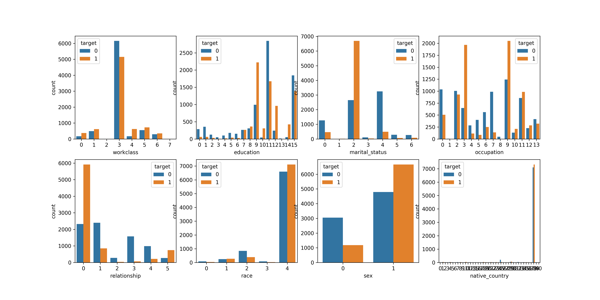

\begin{abstract}
Il existe différents types de données qui exhibent des relations particulières
entre les dimensions. Nous comparerons l'efficacité de différents modèles
d'apprentissage sur deux ensembles de données, les caractères naturels de
l'échantillon MNIST et les données de prédiction salaires. En
particulier, nous nous intéresserons au classifieur de Bayes, aux arbres de
décisions et au perceptron multi-couche. De plus, nous explorerons différents
pré-traitement pour mesurer les gains possibles lorsque combinés avec un modèle
traditionnel de classification. Notre intuition nous porte à croire que les
méthodes de types arbres de décision et classifieur de Bayes seront plus
efficaces sur les prédictions de salaire que sur MNIST. Cette intuition est
justifiée par le fait que les attributs pour les salaires sont plus clairement
scindés. Pour contourner le fait que certains des attributs de l'échantillon de
prédiction de salaire sont de type catégorielle, nous
prévoyons effectué une transformation de type onehot et ainsi considérer des
vecteurs numériques plutôt que des classes.

Finalement, nous proposerons un modèle qui
combine arbres de décisions et classifieur de Bayes naïf aux feuilles afin de
maximiser l'indépendance des composantes.
\end{abstract}

# Analyses préliminaires
Les attributs de l'échantillons de prévision de salaires étaient au nombre de treize (13) et étaient séparables en attributs catégoriels et attributs continus :

**Continus**
  \begin{itemize}
    \item Age
    \item Financial weighted
    \item Capital gains
    \item Capital loss
    \item Hours per week
  \end{itemize}

**Catégoriels**
  \begin{itemize}
    \item Work class
    \item Education
    \item Education code
    \item Marital status
    \item Occupation
    \item Relationship
    \item Race
    \item Sex
    \item Native country
  \end{itemize}

Nous avons choisis de ne considérer que l'entrée *Education* et de laisser tomber *Education code* puisque les deux font référence à la même chose, nous traiterons donc douze (12) attributs.

Pour traiter ces attributs, il était d'abord important de prendre une décision en ce qui a trait au données manquantes. Puisque les algorithmes de type arbre de décision et classifieur de Bayes ne prennent pas de données manquantes, nous avons choisis de faire les remplacements suivants :
\begin{itemize}
  \item[Attributs \textit{continus}] - \textbf{Moyenne} empirique sur $D_{train}$ des valeurs de cet attribut
  \item[Attributs \textit{catégoriels}] - \textbf{Mode} empirique sur $D_{train}$ des valeurs de cet attribut
\end{itemize}
Pour traiter les données catégorielles, il était important de les transformer, tel que discuter dans l'abstract, en vecteur *onehot*. Nous obtenions donc un total de 99 colonnes pour les entrées *onehot*, ainsi que cinq (5) pour les données continues et une (1) pour la sortie (ou cible).

Les graphiques suivants montrent que la tâches de classification ne sera pas triviale. En effet, pour les attributs continus, une PCA ne permet pas d'entrevoir la possibilité d'une séparabilité linéaire des données. La même hypothèse est faites en observant les histogrammes correspondants aux attributs catégoriels puisqu'aucun attribut ne permet de séparer parfaitement les entrées. Quelques valeurs des attributs catégoriels semblent permettre de trancher, ceci laisse croire que l'utilisation d'abre de décision est justifiée.

# Méthodologie

Les données de salaire ont été imputés avec le mode pour les caractéristiques
catégoriques et la moyenne pour celles continues.

La recherche par grille fournie par la classe `GridSearchCV`[^sklearn.model_selection.GridSearchCV]
a été utilisée pour déterminer les meilleurs hyper-paramètres.

Les réseaux de neurones ont été hyper-paramétré à la main et seulement l'époque
optimale a été déterminée par validation croisée.

Nous avons utilisé l'algorithme Adadelta (Zeiler 2012) pour faire
l'optimisation qui utilise une moyenne exponentielle des gradients précédents.

Nous avons également favorisé l'approche Dropout (Srivastava et al. 2014) au
lieu des régularisations L1/L2 puisqu'elle semblait bien fonctionner. Cette
méthode consiste à rendre inneffective une proportion aléatoire d'unités dans
une couche.

[^sklearn.model_selection.GridSearchCV]: http://scikit-learn.org/stable/modules/generated/sklearn.model_selection.GridSearchCV.html

Les courbes d'apprentissages affichent l'erreur de classification en fonction
de la valeur d'un hyper-paramètre en considérant les valeurs des autres
hyper-paramètres qui minimisent l'erreur de validation. Cela fait en sorte que
le minimum observé correspond au vrai minimum.

# Classifieurs de Bayes

Nous avons expérimenté trois variantes du classifieurs de Bayes: à noyau
Gaussien, Bernoulli et une variante mixte.

La variante mixte combine les log-probabilité à postériori de chacun des
modèles de la manière suivante:

\begin{align}
\log \Pr[c|X, X] = \lambda (\log \Pr[c|X]) + (1 - \lambda) (\log \Pr[c|X])
\end{align}

\begin{wrapfigure}{r}{0.5\textwidth}
\includegraphics[width=0.48\textwidth]{figures/mixed-naive-bayes-salary-learning-curve-lambda.png}
\caption{Courbe d'apprentissage du classifieur Bayésien mixte pour le paramètre $\lambda$ sur les données de salaire}
\end{wrapfigure}

Nous remarquons que la variante mixte performe particulièrement bien sur les
données de salaires. Ce qui est remarquable est qu'elle est significativement
meilleure que les deux modèles pures (i.e. chaque extrémités du graphe).

L'autre aspect intéressant est que sa courbe d'apprentissage est identique pour
l'entraînement et la validation, ce qui est consistant avec le fait que les
modèles Bayésiens on une très faible capacité.

\newpage

\begin{wrapfigure}{r}{0.5\textwidth}
\includegraphics[width=0.48\textwidth]{figures/mixed-naive-bayes-salary-learning-curve-alpha.png}
\caption{Courbe d'apprentissage du classifieur Bayésien mixte pour le lissage Laplacien sur les données de salaire}
\end{wrapfigure}

Ici on rajouterais quelques notes sur le lissage Laplacien. Eget ipsum in sem
facilisis convallis. Proin fermentum risus. Vestibulum ante ipsum primis in
faucibus orci luctus et ultrices posuere cubilia Curae; Vestibulum hendrerit
malesuada odio. Fusce ut elit ut augue sollicitudin blandit. Phasellus volutpat
lorem. Duis non pede et neque luctus tincidunt. Duis interdum tempus elit.

Aenean metus. Vestibulum ac lacus. Vivamus porttitor, massa ut hendrerit
bibendum, metus augue aliquet turpis, vitae pellentesque velit est vitae metus.
Duis eros enim, fermentum at, sagittis id, lacinia eget, tellus. Nunc consequat
pede et nulla. Donec nibh. Pellentesque cursus orci vitae urna. Cum sociis
natoque penatibus et magnis dis parturient montes, nascetur ridiculus mus.

\begin{wrapfigure}{r}{0.5\textwidth}
\includegraphics[width=0.48\textwidth]{figures/bernoulli-naive-bayes-mnist-learning-curve-alpha.png}
\caption{Courbe d'apprentissage du classifieur Bayésien à noyau Bernoulli sur MNIST}
\end{wrapfigure}

Pour les données de MNIST, nous avons testé le classifieur de Bayes à noyau
Gaussien ainsi que celui de Bernoulli en arrondissant les degrés de gris à des
valeurs binaires. Le taux de bonnes classifications est particulièrement fort:
83.18%!

Nous sommes portés à croire que puisque les images sont centrée et normalisée,
les similarités entre les exemplaires d'une même classe se traduisent par un
ensemble de pixels communs assez stable. Cette signature est facilement
reconnue par une distribution conjointe de succès.

# Arbres de décisions

\begin{wrapfigure}{r}{0.5\textwidth}
\includegraphics[width=0.48\textwidth]{figures/decision-tree-salary-learning-curve-max-depth.png}
\caption{Courbe d'apprentissage des arbres de décisions sur les données de salaire}
\end{wrapfigure}

\begin{wrapfigure}{r}{0.5\textwidth}
\includegraphics[width=0.48\textwidth]{figures/decision-tree-salary-learning-curve-min-samples-leaf.png}
\end{wrapfigure}

\begin{wrapfigure}{r}{0.5\textwidth}
\includegraphics[width=0.48\textwidth]{figures/decision-tree-mnist-learning-curve-max-depth.png}
\end{wrapfigure}

\begin{wrapfigure}{r}{0.5\textwidth}
\includegraphics[width=0.48\textwidth]{figures/decision-tree-mnist-learning-curve-min-samples-leaf.png}
\end{wrapfigure}

Les arbres de décisions sont des modèles à très forte capacité et la profondeur
maximale est définitivement l'hyper-paramètre contrôlant le mieux la capacité
du modèle.

# Perceptron multi-couche

Le perceptron multi-couche ne convergait pas sur les données de salaire.

\begin{wrapfigure}{r}{0.5\textwidth}
\includegraphics[width=0.48\textwidth]{figures/multilayer-perceptron-salary-learning-curve-epoch.png}
\end{wrapfigure}

\begin{wrapfigure}{r}{0.5\textwidth}
\includegraphics[width=0.48\textwidth]{figures/multilayer-perceptron-mnist-learning-curve-epoch.png}
\end{wrapfigure}

\begin{wrapfigure}{r}{0.5\textwidth}
\includegraphics[width=0.48\textwidth]{figures/convolutional-neural-network-mnist-learning-curve-epoch.png}
\end{wrapfigure}

# Résultats finaux

Les tableaux suivants corresponent aux valeurs de précision sur les ensembles
de tests des meilleurs modèle déterminés par le processus de validation.

Salary Validation Test
-----  ---------- ----
MNB    83.81%     73.01%
DT     85.57%     75.82%
NN     75.45%     76.37%

En générale, on remarque que les modèles utilisés n'ont pas très bien
fonctionné sur la classification de données de salaire puisque la précision est
très proche de la répartition des classes.

MNIST Validation Test
----- ---------- ----
NB    56.28%     55.77%
BNB   83.18%     83.36%
DT    86.19%     87.37%
NN    96.93%     96.86%
CNN   98.77%     98.87%

# Répartition

Guillaume s'est occupé de la programmation et Gabriel de la rédaction de la
présentation du projet et du rapport.

Nous avons fait l'analyse exploratoire des données ensemble.

# Références
