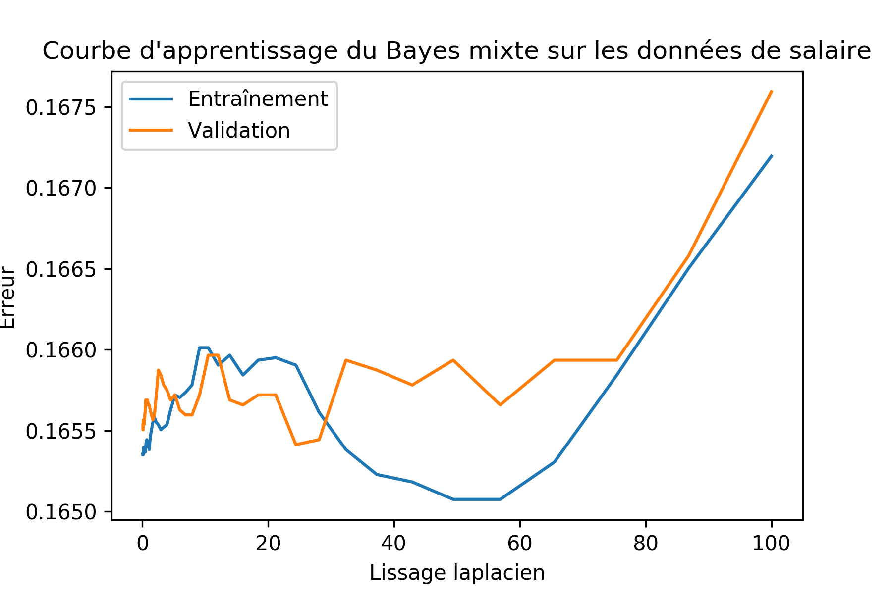
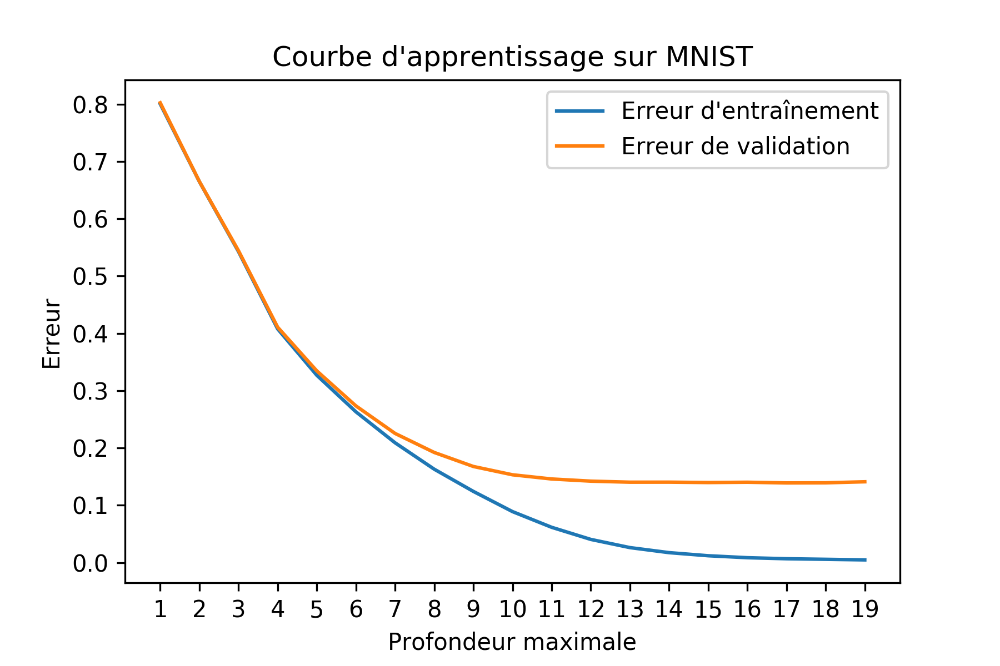
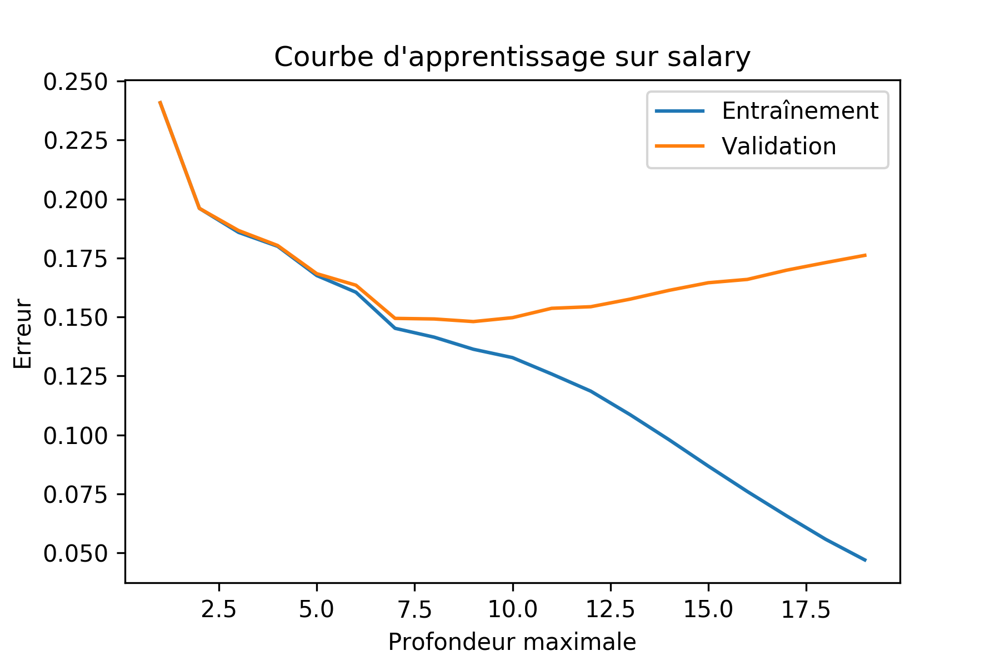

\begin{abstract}
Il existe différents types de données qui exhibent des relations particulières
entre les dimensions. Nous comparerons l'efficacité de différents modèles
d'apprentissage sur deux ensembles de données, MNIST et salaires. En
particulier, nous nous intéresserons au classifieur de Bayes, aux arbres de
décisions et au perceptron multi-couche. De plus, nous explorerons différents
pré-traitement pour mesurer les gains possibles lorsque combinés avec un modèle
traditionnel de classification. Notre intuition nous porte à croire que les
méthodes de types arbres de décision et classifieur de Bayes seront plus
efficaces sur les prédictions de salaire que sur MNIST. Cette intuition est
justifiée par le fait que les attributs pour les salaires sont plus clairement
scindés. Pour contourner le fait que certains des attributs de l'échantillon de
prédiction de salaire sont de type catégorielle, nous
prévoyons effectué une transformation de type onehot et ainsi considérer des
vecteurs numériques plutôt que des classes.

Finalement, nous proposerons un modèle qui
combine arbres de décisions et classifieur de Bayes naïf aux feuilles afin de
maximiser l'indépendance des composantes.
\end{abstract}

Points importants pour les données de salaire:

 - imputation des données
 - classification d'attributs mixtes

# Classifieur de Bayes

# Arbres de décision

