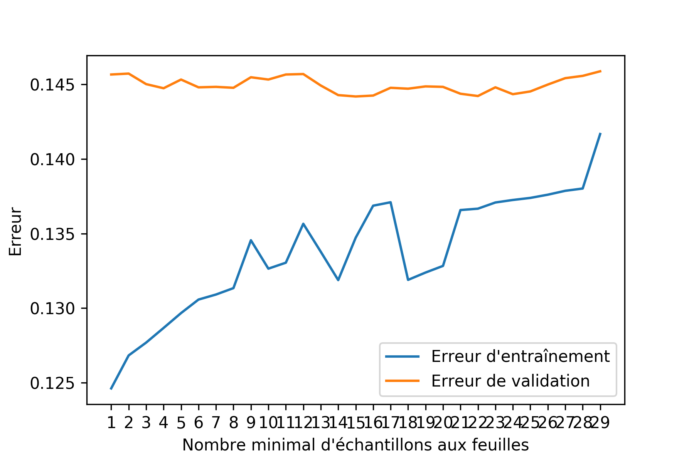
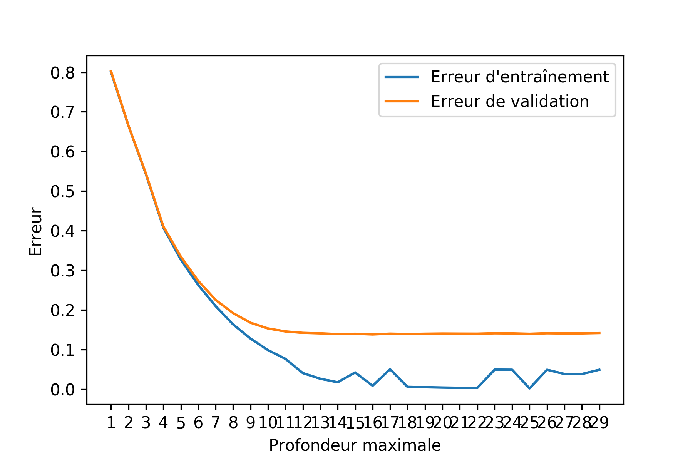
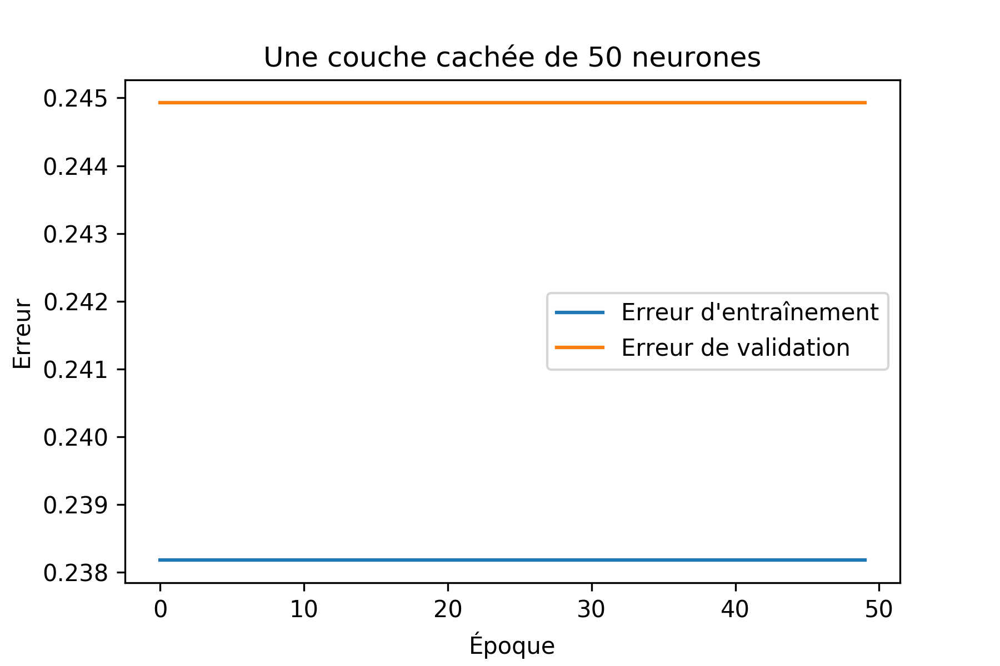
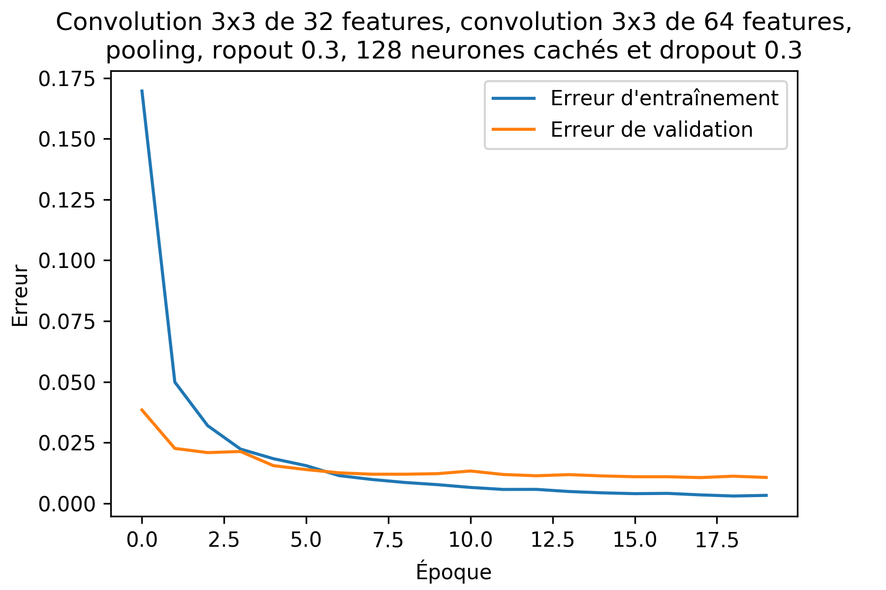

\begin{abstract}
Il existe différents types de données qui exhibent des relations particulières
entre les dimensions. Nous comparerons l'efficacité de différents modèles
d'apprentissage sur deux ensembles de données, MNIST et salaires. En
particulier, nous nous intéresserons au classifieur de Bayes, aux arbres de
décisions et au perceptron multi-couche. De plus, nous explorerons différents
pré-traitement pour mesurer les gains possibles lorsque combinés avec un modèle
traditionnel de classification. Notre intuition nous porte à croire que les
méthodes de types arbres de décision et classifieur de Bayes seront plus
efficaces sur les prédictions de salaire que sur MNIST. Cette intuition est
justifiée par le fait que les attributs pour les salaires sont plus clairement
scindés. Pour contourner le fait que certains des attributs de l'échantillon de
prédiction de salaire sont de type catégorielle, nous
prévoyons effectué une transformation de type onehot et ainsi considérer des
vecteurs numériques plutôt que des classes.

Finalement, nous proposerons un modèle qui
combine arbres de décisions et classifieur de Bayes naïf aux feuilles afin de
maximiser l'indépendance des composantes.
\end{abstract}

Points importants pour les données de salaire:

 - imputation des données
 - classification d'attributs mixtes

Les données de salaire ont été imputés avec le mode pour les caractéristiques
catégoriques et la moyenne pour celles continues.

# Classifieurs de Bayes

Nous avons expérimenté trois variantes du classifieurs de Bayes: à noyau
Gaussien, Bernoulli et une variante mixte.

Nous remarquons que la variante mixte performe particulièrement bien sur les
données de salaires. Ce qui est remarquable est qu'elle est significativement
meilleure que les deux modèles pures.

Pour les données de MNIST, nous avons testé le classifieur de Bayes à noyau
Gaussien ainsi que celui de Bernoulli en arrondissant les degrés de gris à des
valeurs binaires. En validation croisée, nous obtenon??% de précision.

# Arbres de décision

# Perceptron multi-couche

# Résultats finaux

Les tableaux suivants corresponent aux valeurs de précision sur les ensembles
de tests des meilleurs modèle déterminés par le processus de validation.

Salary Précision
-----  ---------
MNB    73.01%
DT     76.09%
NN     76.37%

MNIST Précision
----- ---------
NB    55.77%
BNB   83.36%
DT    87.37%
NN    96.86%
CNN   98.87%

